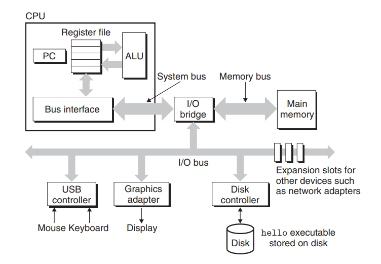
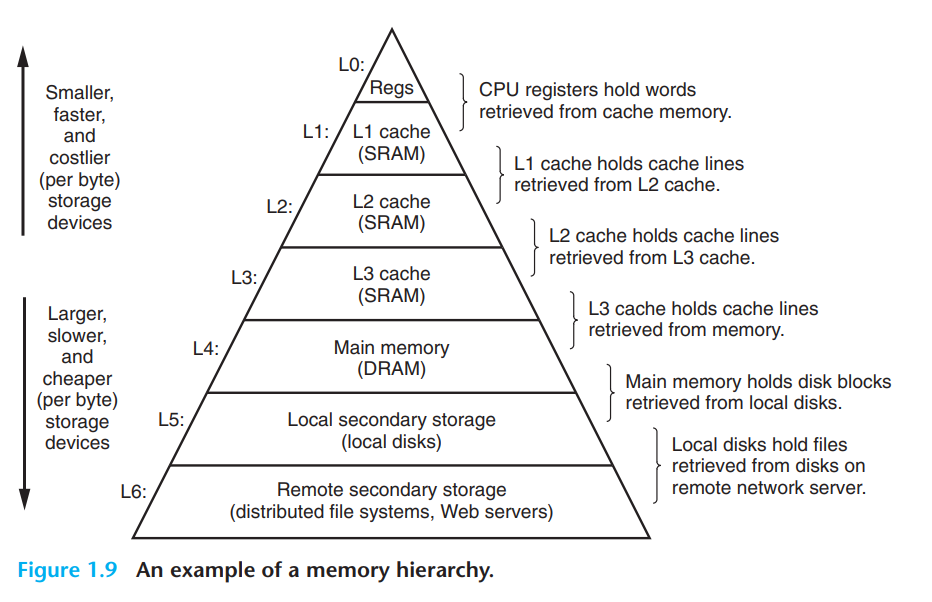

# 1. A Tour of Computer Systems

이 챕터에서는 간단한 Hello World 프로그램이 어떤 lifetime으로 진행되는지 따라가며 key concept들을 알아본다.

```c
#include <stdio.h>

int main() {
	printf("hello, world\n");
	return 0;
}
```

---

## 1.1 Information Is Bits + Context

- hello 프로그램은 맨 처음에 프로그래머가 만든 source file이다.
- source file은 bits의 sequence이다. 0, 1이 8-bit 씩 모아진 bytes의 연속이고, 각 byte는 한 text character를 나타낸다.
- 대부분의 컴퓨터 시스템에서는 ASCII 코드에 따라 text character를 숫자로 나타낸다.
- 따라서 hello 프로그램은 사실 아래와 같다.

```c
#   i   n   c   l   u   d   e   sp  <   s   t   d   i   o   .   h   >   \n
35	105	110	99	108	117 100 101 32	60	115	116	100	105	111	46	104	62	10
```

- ASCII code로 표현되는 파일은 text file, 다른 파일은 binary file 이다.
- **모든 파일(disk file, programs, user data...)은 text file이다.** 같은 sequence의 bytes를 context에 따라 정수, 실수, 문자 등으로 해석할 뿐이다.

---

## 1.2 Programs Are Translated by Other Programs into Different Forms

- hello 프로그램은 실행되기 위해 low-level machine language로 바뀌었다가 executable object program file로 패키징된다.
- 이 실행파일(object file)은 binary disk file이다.
- `$ gcc -o hello hello.c` 명령어를 실행하면 compilation system 4단계를 거쳐 hello라는 object file이 생긴다.

  1.  **preprocessing phase(hello.c -> hello.i):**  
      전처리기(cpp)가 #으로 시작하는 구문의 명령을 처리한다. `#include <stdio.h>`에 따르면 stdio.h 헤더파일의 내용을 소스파일에 추가한다.
  2.  **compilation phase(hello.i -> hello.s):**  
      컴파일러(cc1)가 assembly-language 프로그램을 만든다.

      ```c
      main:
      	subq	$8, %rsp
      	movl	$.LC0, %edi
      	call	puts
      	movl	$0, %eax
      	addq	$8, %rsp
      	ret
      ```

      서로 다른 high level 언어를 위한 컴파일러여도 모두 어셈블리어로 된 결과가 나온다.

  3.  **Assembly phase(hello.s -> hello.o):**  
      어셈블러(as)가 hello.s를 machine-language instruction으로 바꾸고, relocatable object program으로 패키징한다. 바이너리 파일이다.
  4.  **Linking phase:**  
      printf 함수는 printf.o라는 파일에 존재한다. hello.o 프로그램에 합쳐지도록 링커(ld)가 작동한다.

---

## 1.3 It Pays to Understand How Compilation Systems Work

- 프로그램의 performance를 최적화하기 위해
- link-time error들을 이해하기 위해
- security hole을 막기 위해 (buffer overflow vulnerabilities로 인한 보안문제)

컴파일 과정을 이해해야한다.

---

## 1.4 Processors Read and Interpret Instructions Stored in Memory

```sh
$ ./hello
hello, world
$
```

shell은 ./hello가 shell command에 없으므로 실행가능한 파일임을 가정하고 파일을 load 한다. 실행 후에는 terminate할 때까지 기다린다.

**1.4.1 Hardware Organization of a System**


- Buses  
  각 컴포넌트 사이에 bytes를 전기적으로 전송하는 것. `words`라고 불리는 고정된 사이즈의 bytes를 전송하도록 설계되어있다. 4 bytes (32 bits) 또는 8 bytes (64 bits)를 대부분 사용한다.
- I/O Devices  
  외부 세상과 시스템의 연결고리이다. 키보드, 마우스, 디스크 등이 포함된다. 각 입출력 장치는 I/O Bus에 컨트롤러나 어댑터로 연결되어있다.
- Main Memory  
  프로그램이 실행 중일때 그 프로그램과 그 프로그램이 관여 중인 데이터가 저장되는 곳이다. dynamic random access memory(DRAM)으로 구성된다. 메모리는 unique한 주소를 가지고 있다.
- Processor (central processing unit)  
  main memory에 저장된 명령을 실행한다. 프로세서의 코어는 word-size의 레지스터인 program counter(PC)이다. PC는 항상 main memory의 어떤 machine-language 명령(의 주소)을 가리키고 있다.  
  레지스터 파일은 여러개의 word-size 레지스터 저장소의 모음이다.

  CPU는 다음과 같은 명령을 실행한다:

  - load: 주기억장치에서 레지스터로 정보 복사
  - store: 레지스터에서 주기억장치로 정보 복사
  - operate: ALU(arithmetic/logic unit)로 피연산자 두개 복사, 명령 실행, 결과를 레지스터에 복사
  - jump: 명령에서 정보를 복사하여 PC로 복사

**1.4.2 Running the `hello` program**

- shell에 `./hello`라고 입력 =(I/O Bus)=> Register file => Main Memory
- enter key 입력: disk의 hello와 데이터 =(I/O Bus)=> Main Memory (Direct Memory Access)
- processor가 hello 프로그램의 main 루틴 실행: 메모리의 "hello, world\n" 바이트 복사 => 레지스터 =(I/O Bus)=> 스크린

---

## 1.5 Caches Matter

- 실제 실행 과정보다 이리저리 복사하는 과정이 많음 => overhead 발생
- 복사 시간을 최대한 줄이는 것에 초점
- 작은 저장소 크기 => 빠른 로딩
- 디스크 보다는 주기억장치가, 주기억장치보다는 레지스터 파일의 데이터를 불러오는게 훨씬 빠름 (processor-memory gap)
- processor-memory gap을 해결하기 위해 더 작고 빠른 저장소인 Cache 만듦

---

## 1.6 Storage Devices Form a Hierarchy



- 메모리 위계의 원리: 한 단계가 다음 단계의 Cache 로 작용한다.
- 아래로 갈수록 용량은 커지고 속도는 느려지고 값은 싸진다.
- 메모리 위계를 잘 따져 코딩할 수 있다면 효율적인 코드를 짤 수 있다.

---

## 1.7 The Operating System Manages the Hardware

- application level 프로그램들은 실행될 때 Operating System을 거쳐야만 주기억장치나 I/O 장치에 접근할 수 있다.
- 이렇게 하는 이유는
  - 하드웨어의 오용을 방지
  - 복잡한 low-level 하드웨어를 application에서 쉽게 다룰 수 있음
- processes, virtual memory, files로 추상화

**1.7.1 Processes**

- process: 프로그램을 실행하는 운영체제의 추상화
- 동시에 여러 개의 프로세스가 실행될 수 있다.
  - 사실은 한 번에 하나만 실행가능하다.
  - 멀티프로세서는 동시에 실행가능하다.
  - 두 경우 모두, CPU가 여러 개의 프로세스를 수행할 수 있는 것처럼 보인다.
- context switching: 현 프로세스의 context를 저장하고, 새 프로세스의 context를 로드한다.
  - context: PC의 값, 레지스터 파일, 메인 메모리의 값
- shell 프로세스 => ./hello 입력 => (system call) shell 프로세스 context 저장, 새로운 프로세스 생성 => hello 프로세스 실행 => hello terminates => (system call) hello context 저장, shell 프로세스 로드
